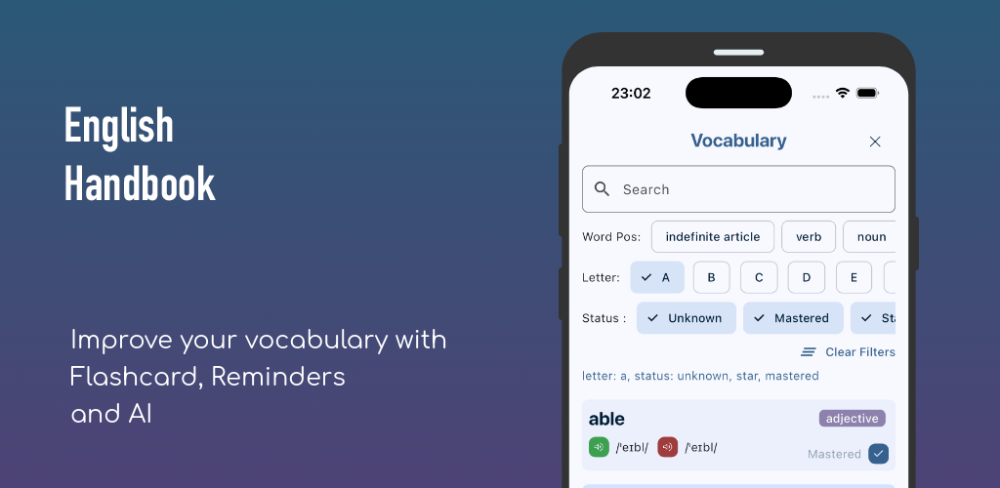
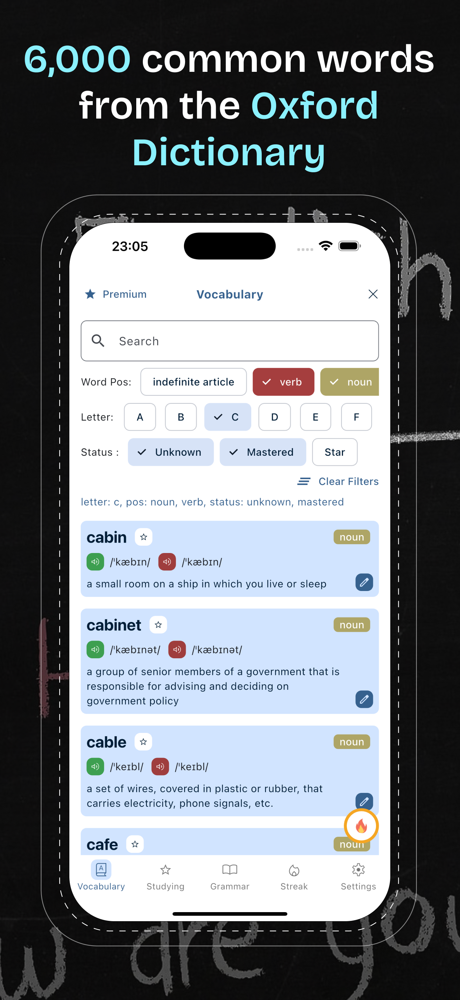
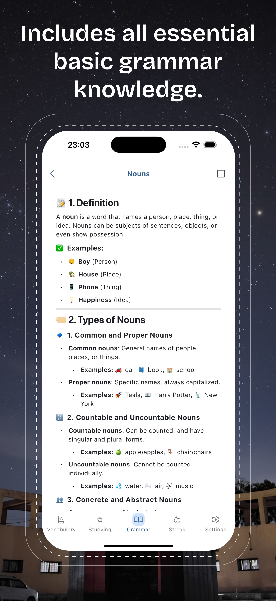
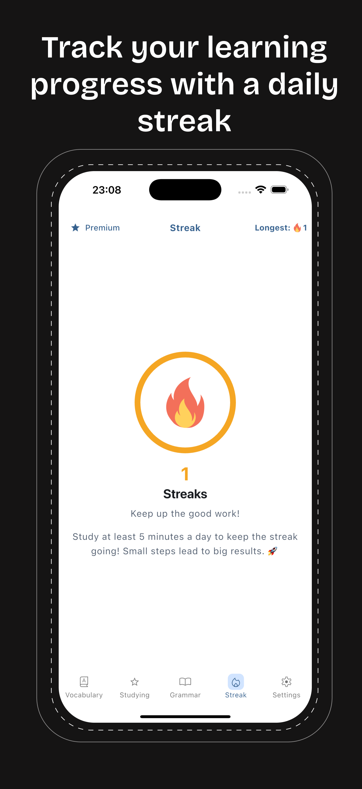
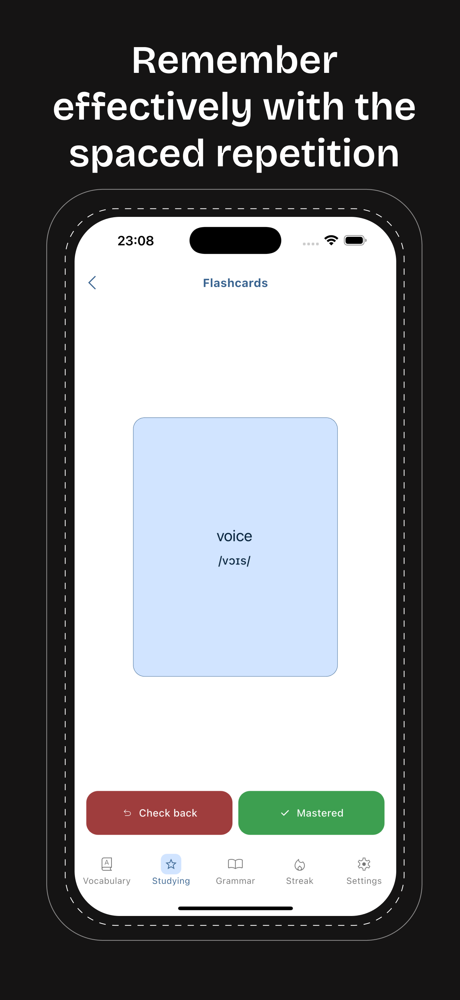
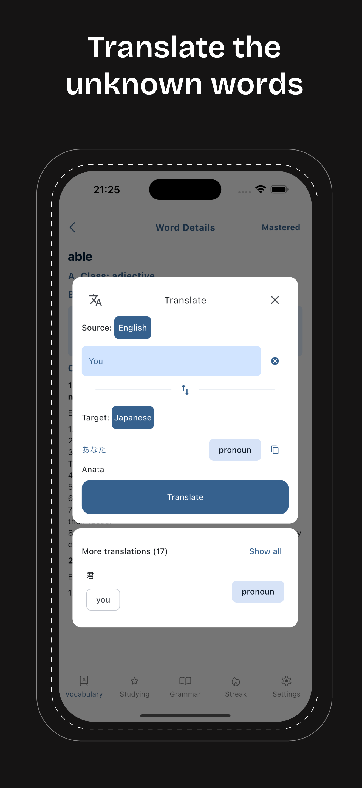
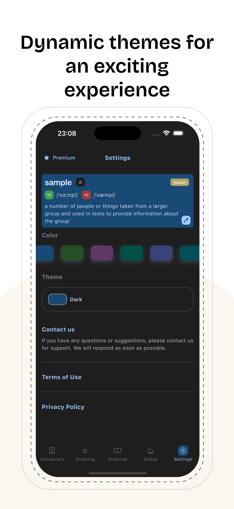

<p align="center">
  
</p>


<h1 align="center">English Handbook - Learning</h1>

<p align="center">
  
</p>

## ✨ Features

<p align="center">
  
  
  
  
  
  
</p>

Master English Vocabulary & Grammar with Ease!

Our app goes beyond vocabulary! Now, in addition to learning 6,000+ of the most common words from the Oxford Dictionary, you can also improve your grammar with our new Grammar Handbook—your complete guide to mastering English rules and structures.

Key Features:
📖 Grammar Handbook – Learn essential grammar rules with clear explanations and examples to enhance your writing and speaking skills.
📝 Vocabulary Builder – Expand your word bank with curated word lists, flashcards, and review tools.
🔔 Custom Reminders – Get daily notifications for new words or grammar tips to keep learning consistently.
🔥 Streak Tracking – Stay motivated by maintaining your learning streak and reaching new milestones.

Whether you're a student, professional, or language enthusiast, this app is your ultimate companion for mastering English. Start learning today! 🚀

# 📥 Download My App

<p align="center">
  <a href="https://play.google.com/store/apps/details?id=com.alexcao.grammar_polisher">
    
  </a>
  <a href="https://apps.apple.com/us/app/english-handbook-learning/id6741855072">
    
  </a>
</p>

---

# 🌐 Landing Page

🔹 [**Dev Pullstack**](https://pullstack.id.vn/) - Personal Portfolio  
🔹 [**English Handbook**](https://pullstack.id.vn/pages/english_handbook/) - English Handbook

---

# 🤝 Connect with Me

<p align="center">
  <a href="https://www.youtube.com/@dev.pullstack">
    
  </a>
  <a href="https://github.com/alexcao194">
    
  </a>
  <a href="https://www.tiktok.com/@dev.pullstack">
    
  </a>
  <a href="https://facebook.com/alexcao194">
    
  </a>
</p>


## Support & Donations

<a href="https://www.buymeacoffee.com/jKBSanOvvw" target="_blank"></a>

## Required Environment

### Framework
- [Flutter SDK >= 3.27.0](https://flutter.dev/docs/get-started/install)
- [Dart SDK >= 3.6.0](https://dart.dev/get-dart)

### Android
- [Android Studio >= Ladybug](https://developer.android.com/studio)
- [Android SDK](https://developer.android.com/studio)

### iOS
- [Xcode >= 15.0](https://developer.apple.com/xcode/)
- [Cocoapods >= 1.16.2](https://cocoapods.org)

## Should Have Android Studio Plugins
- Flutter
- Dart
- FlutterAssetsGenerator
- Bloc

## Folder structure
- `assets`: The folder to store resources file such as fonts, images and lottie animations
    - `images`: store images
    - `sounds`: store sounds
    - `fonts`: store fonts
- `lib`: The folder is main container of all code inside Zeniuz application
    - `configs`: Configuration of Router, Supabase, etc.
    - `constants`: Constants of application
    - `core`: Base classes, extensions, etc.
    - `data`:
        - `data_sources`: Data sources such as API, Database, realtime, etc.
        - `models`: Data models convert from raw data to entity
        - `repositories`: Repositories to interact with data sources
    - `gererared`: Generated files (intl, assets, etc.)
    - `navigation`: Navigation of application
    - `ui`: User interface
        - `commons`: Common and base widgets
        - `screens`:
            - `home`:
                - `bloc`: Join screen bloc
                - `widgets`: Widgets of Join screen
                - `home_screen.dart`: Join screen
    - `utils`: Helper functions
    - `main.dart`: Entry point of application
    - `app.dart`: Wrapper of application

## Code style
- Follow [Effective Dart](https://dart.dev/guides/language/effective-dart/style)
- Import from dart package first, then flutter package, then project package, then current package
- Importing from the same package should be in one line and use relative path
    - ex: `import '../../models/user_model.dart'`

## Usage

### Install dependencies
- Move to root dir `cd {root}`
- Install necessary packages `flutter pub get`

### Generate files
- Generate necessary files: `flutter pub run build_runner build --delete-conflicting-outputs`
- Click `Build` -> `Generate Flutter Assets` to generate assets path
- Note: If you create a new assets folder, right-click on the folder and click `Flutter: Configuring Paths` to add assets path into `pubspec.yaml`

### Add Google Services
- Download `google-services.json` from Firebase and put it in `android/app/src/development` folder
- Download `GoogleService-Info.plist` from Firebase and put it in `ios/Runner/GoogleServices` folder, then rename it to `GoogleService-Info-Development.plist`
- Do the same for `production` flavor

### Run
- We have 2 flavors: `development` and `production`
- Remove `.example` in `.env.example` folder or create your own env file and put it in `.env/` folder, that named `development.json`
- Run `flutter run --flavor development --dart-define-from-file=.env/development.json` to run the app in development mode

### Sign with your own keystore
- Create a keystore file `keystore.jks`, it should be placed in `android/app` folder
- Create a file `key.properties` in `android` folder with the following content:

```
storePassword=<password>
keyPassword=<password>
keyAlias=<alias>
storeFile=<relative path to keystore file> (from android/app)
```

### Build
This project uses Fastlane to build and release the app. To build the app, you can run the following commands:
- Android:
    - `cd android`
    - `fastlane release --env production`
- IOS:
    - `cd ios`
    - `fastlane release --env production`

And That's it! You are ready to go! 🚀

## Contributing
- Clone the repository
- See [CONTRIBUTION.md](CONTRIBUTION.md) for more details

